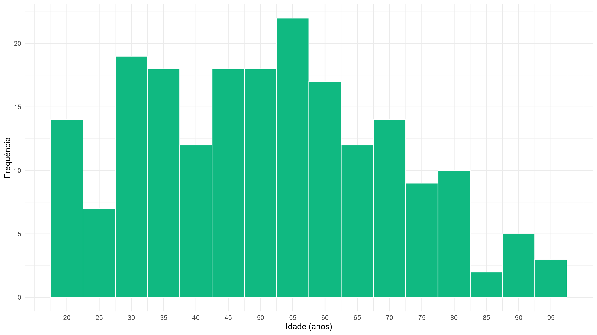
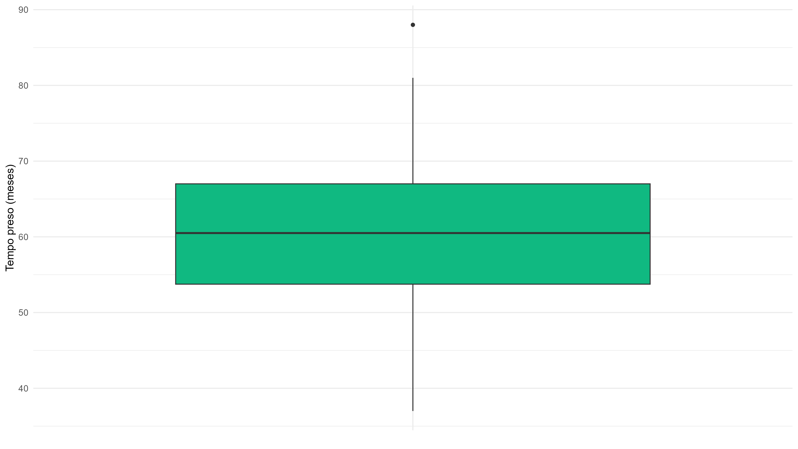
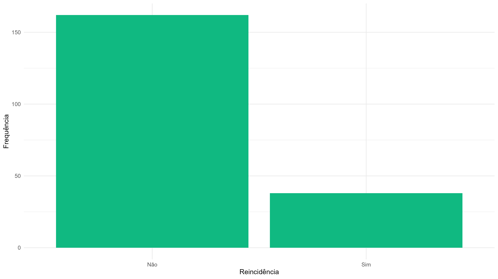
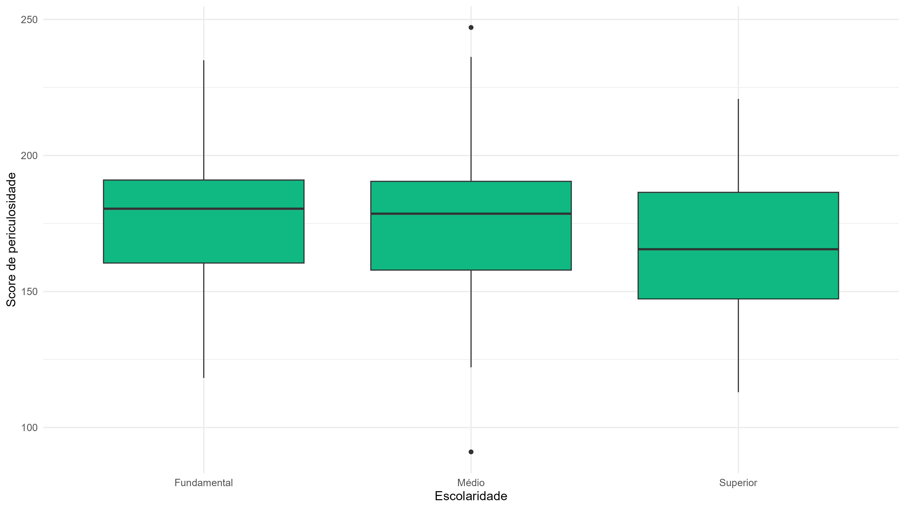
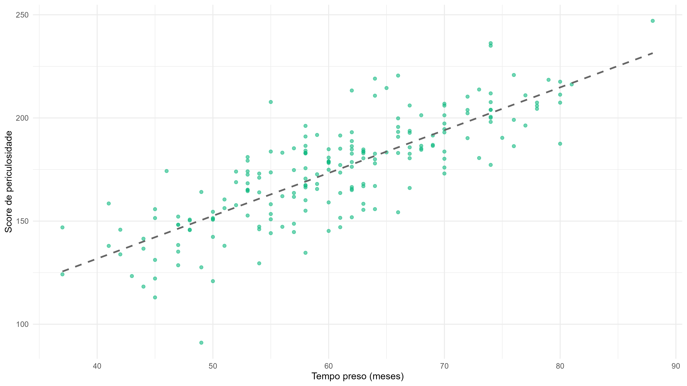

# Análise Exploratória
Repositório destinado às atividades da disciplina **Prática Estatística 2**, ministrada pela professora Ludmilla Viana na Universidade Federal Fluminense (UFF).

## 0. Contextualização
A base de dados utilizada contém informações fictícias sobre indivíduos privados de liberdade, como forma de praticar o uso integrado do R e GitHub.

Neste README, serão apresentados os resultados obtidos através de uma análise exploratória em tal base de dados, em busca de compreender melhor o comportamento e as relações entre as variáveis.

---

## 1. Metodologia
Além dos gráficos, foram calculadas **medidas-resumo** que descrevem a tendência central e a dispersão dos dados, conforme as definições apresentadas a seguir.
<!-- Optei por, em algumas fórmulas, gerar imagens no site https://latex.codecogs.com, pois estava tendo problemas com a renderização do LaTeX. -->

### Média
<!--  -->
$\bar{x}=\frac{1}{n}\sum_{i=1}^{n}x_i$

### Quantil
O quantil de ordem $p$ é um valor pertencente à amostra tal que, pelos menos $100 p \%$ dela é menor ou igual a esse valor.

> **OBS:** $Q_1$, $Q_2$ e $Q_3$ são, respectivamente, os quantis de ordem 0.25, 0.5 e 0.75.   Além disso, a mediana é definida como o $Q_2$, por definição.

### Variância
<!-- ^2) -->
$s^2=\frac{1}{n-1}\sum_{i=1}^{n}(x_i-\bar{x})^2$

### Desvio Padrão
<!--  -->
$s=\sqrt{s^2}$

### Amplitude
<!-- -\min(x_i)) -->
$A=\max(x_i)-\min(x_i)$

---

## 2. Resultados

### 2.1 Idade
<!-- Utilizei HTML em algumas imagens para reduzir um pouco o tamanho das imagens, pois achei que estavam um pouco grande demais. -->

A distribuição das idades dos detentos é bem espalhada, com concentrações maiores entre adultos e idosos (na faixa dos 30-70).   Não há um pico muito definido, porém, entre os dados observados, a maior quantidade de detentos ocorre por volta dos 55 anos. 

### 2.2 Tempo de prisão

O tempo de prisão apresenta uma mediana ao redor de ~60 meses, com valores variando bastante.  Apesar da haver uma única observação fora da faixa esperada, nota-se que, no geral, os tempos seguem um padrão relativamente estável e usual.

### 2.3 Reincidência

O gráfico revela que a maioria dos presos não é reincidente, mas ainda existe uma parcela relevante que retornou ao sistema prisional.

### 2.4 Periculosidade x Escolaridade

Os níveis de periculosidade são parecidos entre as faixas de escolaridade, não ocorrendo grandes diferenças entre ensino fundamental, médio e superior.  Pequenas variações existem, mas nada que indique uma tendência clara associada ao nível educacional.

### 2.5 Periculosidade x Tempo de prisão

> O coeficiente de correlação de Pearson estimado foi de $\approx 0.80$.

Nota-se uma forte relação linear positiva entre os níveis de periculosidade e o tempo de prisão, indicando que, quanto maior o tempo de prisão, maior é o nível de periculosidade assumido para tal detento.    
Essa é uma conclusão interessante, pois reforça a validade do score de periculosidade como um bom indicador, uma vez que esse é exatamente o desfecho esperado de um detento com maior nível de periculosidade.

### 2.6 Tabela de medidas-resumo
| Variável               | Média |   Q1  | Mediana (Q2) |   Q3  | Variância | Desvio Padrão | Amplitude |
|------------------------|:-----:|:-----:|:-------:|:-----:|:---------:|:------:|:---------:|
| idade                  | 50.92 | 34.00 |  52.00  | 64.25 |   374.08  | 19.34  |   79.00   |
| tempo_preso            | 60.59 | 53.75 |  60.50  | 67.00 |    99.09  |  9.95  |   51.00   |
| score_periculosidade   | 174.52| 155.70| 177.21  | 191.12|   660.58  | 25.70  |  156.02   |

---

## 3. Conclusão
De modo geral, os resultados são coerentes e reforçam a importância da análise exploratória para identificar padrões e relações entre as variáveis. Eles também sugerem caminhos para estudos futuros, que possam testar hipóteses e aprofundar a compreensão sobre o comportamento dos dados.
